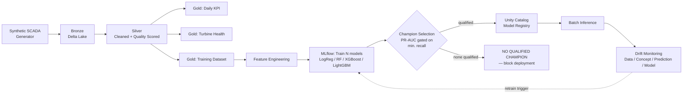

# Wind Turbine Predictive Maintenance — Databricks MLOps Platform

An end-to-end MLOps pipeline on Databricks that predicts wind turbine
component failures 24 hours before they happen — Bronze → Silver → Gold →
Feature Engineering → Multi-model training → Champion/Challenger selection →
Unity Catalog Model Registry → Batch inference → Drift monitoring.

> **Origin story:** this started as a take-home pipeline-design exercise for
> a Data Engineer interview at a major wind-turbine manufacturer. Rather than
> deliver just the data pipeline they specified, I extended the scope into a
> full production-style MLOps lifecycle and rebuilt it as a modular,
> testable repository — see [Background](#background) below.

## Architecture



## Why this exists

Most "MLOps demo" repos either stop at model training or hand-wave the
production concerns (target leakage, champion/challenger gating, drift
detection, idempotent ingestion). This project tries to actually implement
those pieces for a realistic predictive-maintenance use case:

- **Physics-informed synthetic data** — wind→power curves, load→temperature
  relationships, and failures driven by a genuine degradation process
  (health score decays over 24–168 hours before failure), not
  `random() < 0.05`.
- **Leakage-safe target construction** — `failure_within_next_24_hours` is
  built via a forward-looking join against future failure events, with
  records already in a failure state explicitly excluded.
- **A real Champion/Challenger gate** — the primary metric (PR-AUC) is only
  considered *after* filtering to models that clear a configured minimum
  recall. If nothing clears the bar, the pipeline prints
  `NO QUALIFIED CHAMPION` and refuses to register or deploy anything.
- **Four kinds of drift, actually implemented** — data drift (PSI + KS-test),
  concept drift (target distribution shift), prediction drift (score
  distribution shift), and model drift (recall/precision/F1 degradation),
  each writing to its own Unity Catalog monitoring table.

## Tech stack

`Databricks` · `PySpark` · `Delta Lake` · `Unity Catalog` · `MLflow` ·
`scikit-learn` · `XGBoost` · `LightGBM` · `Databricks Asset Bundles` ·
`pytest`

## Repository structure

```
wind-turbine-mlops/
├── src/
│   ├── common/            # config.py, schema.py (single source of truth)
│   ├── data_generation/   # synthetic SCADA generator
│   ├── ingestion/         # Bronze — idempotent MERGE-based ingestion
│   ├── transformations/   # Silver cleaning, Gold KPI/health/training
│   ├── features/          # rolling/trend/lag feature engineering
│   ├── models/            # champion selection, UC model registry
│   ├── serving/           # batch inference
│   └── monitoring/        # data/concept/prediction/model drift detectors
├── notebooks/              # 01–12, orchestration entry points
├── tests/unit/              # pytest — real, executable, CI-able
├── resources/                # Databricks Jobs / Serving / permissions
├── configs/                  # dev / test / prod scale configs
└── databricks.yml            # Databricks Asset Bundle definition
```

## Quick start

```bash
git clone <this-repo>
cd wind-turbine-mlops
pip install -r requirements.txt

# Run the test suite locally (no Databricks workspace needed for this part)
PYTHONPATH=. pytest tests/unit/ -v

# Deploy to a Databricks workspace via Asset Bundles
databricks bundle deploy -t dev
databricks bundle run -t dev wind_turbine_mlops_job
```

`configs/dev.yml` runs small (10 turbines / 1 month) for fast iteration;
`configs/prod.yml` scales to 60 turbines / 12 months / ~3.15M SCADA records.

## Project status

This is a portfolio/demonstration project, not a production deployment —
built and refined in short, intense iterations with a lot of "run it, see
what breaks, fix it" rather than a slow polish. In the interest of not
overselling it:

- ✅ Data generation → Bronze → Silver → Gold → drift detection: fixed and
  covered by real pytest tests run against PySpark (not just described).
- ✅ Champion/Challenger gating and Unity Catalog registry logic: verified
  correct — uses current UC registry APIs, not deprecated ones.
- ⚠️ Feature engineering / model training stages are still sequential
  notebook-style code (they rely on prior-cell state rather than clean
  function signatures) — next on the list to refactor.
- ❌ Model Serving deployment is a template, not a live, tested endpoint —
  that needs an actual workspace to stand up.

Full details in the codebase's own README under each module.

## Background

I interviewed for a Data Engineer role at a large wind-turbine manufacturer
and was given a spec to design a Databricks data pipeline for turbine sensor
data. I decided to go further than the brief and design what the
**next step** of that pipeline would realistically look like in production —
a full predictive-maintenance MLOps lifecycle, not just ingestion and
cleaning. I built and iterated on this version using Claude and Databricks
Genie, treating the AI output the way I'd treat a junior engineer's PR: read
it, ran it, found real bugs (a schema mismatch that broke the pipeline
end-to-end, an undefined variable, a couple of import-order bugs introduced
during refactoring), and fixed them rather than shipping on faith.

## License

MIT — use freely, attribution appreciated.
